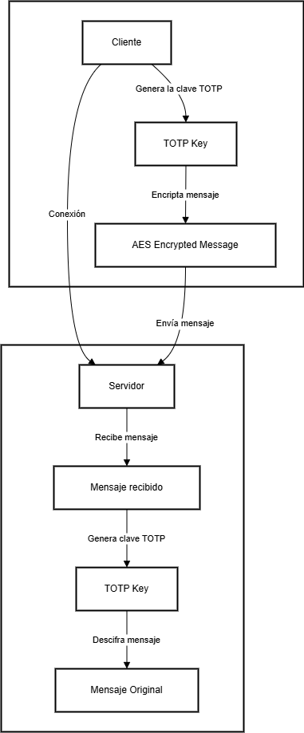

# Comunicación Segura Cliente-Servidor con TOTP y AES en C++

Este proyecto implementa una comunicación segura entre un cliente y un servidor usando sockets en C++ y cifrado simétrico AES, donde la clave de cifrado se deriva dinámicamente usando TOTP (Time-based One-Time Password) y un secreto compartido.

---

## Arquitectura



---

## Características

- **Cifrado AES-256:** Protección de los mensajes transmitidos.
- **Derivación de clave con TOTP:** La clave AES se genera dinámicamente cada 30 segundos usando un secreto compartido y el tiempo actual.
- **Sockets en C++:** Comunicación TCP/IP entre cliente y servidor.
- **Docker:** Contenedores para facilitar la ejecución y pruebas.

---

## Estructura del Proyecto

```
.
├── client/                 # Código fuente del cliente
│   ├── client.cpp
│   └── totp_aes_utils.h
├── server/                 # Código fuente del servidor
│   ├── server.cpp
│   └── totp_aes_utils.h
├── Dockerfile              # Imagen base para cliente y servidor
├── docker-compose.yml      # Orquestación de contenedores
├── README.md               # Documentación del proyecto
└── Cliente-Servidor.drawio.png  # Diagrama de arquitectura
```

---

## Instalación y Ejecución

### Opción 1: Usando Docker

1. Clona el repositorio:
   ```bash
   git clone https://github.com/JuanSeRestrepoNieto/final-analisis-alg.git
   cd final-analisis-alg
   ```
2. Construye y levanta los contenedores:
   ```bash
   docker-compose up --build
   ```

   Esto iniciará tanto el servidor como el cliente en contenedores separados pero que se comunican entre si.

### Opción 2: Compilación Manual

1. Clona el repositorio y navega a la carpeta:
   ```bash
   git clone https://github.com/JuanSeRestrepoNieto/final-analisis-alg.git
   cd final-analisis-alg
   ```
2. Compila el servidor:
   ```bash
   g++ -std=c++17 server/server.cpp -o server -lssl -lcrypto
   ```
3. Compila el cliente:
   ```bash
   g++ -std=c++17 client/client.cpp -o client -lssl -lcrypto
   ```
4. Ejecuta el servidor:
   ```bash
   ./server
   ```
5. En otra terminal, ejecuta el cliente:
   ```bash
   ./client
   ```

---

## Funcionamiento

### Cliente

1. **Genera la clave TOTP:** Usando el secreto compartido y el tiempo actual.
2. **Encripta el mensaje:** Utiliza AES-256 con la clave derivada.
3. **Envía el mensaje cifrado:** A través de un socket TCP al servidor.

### Servidor

1. **Recibe el mensaje cifrado:** Desde el cliente.
2. **Genera la misma clave TOTP:** Usando el mismo secreto y el tiempo.
3. **Descifra el mensaje:** Utilizando AES-256 y la clave derivada.
4. **Muestra el mensaje original.**

---

## Seguridad

- **Clave dinámica:** La clave AES cambia cada 30 segundos, dificultando ataques de repetición o descifrado.
- **Secreto compartido:** Solo cliente y servidor conocen el secreto base.

---

## Contribuciones

Las contribuciones son bienvenidas. Por favor, abre un issue o pull request para discutir cambios importantes.

---

## Licencia

Este proyecto está licenciado bajo la Licencia MIT. Consulta el archivo LICENSE para más detalles.
